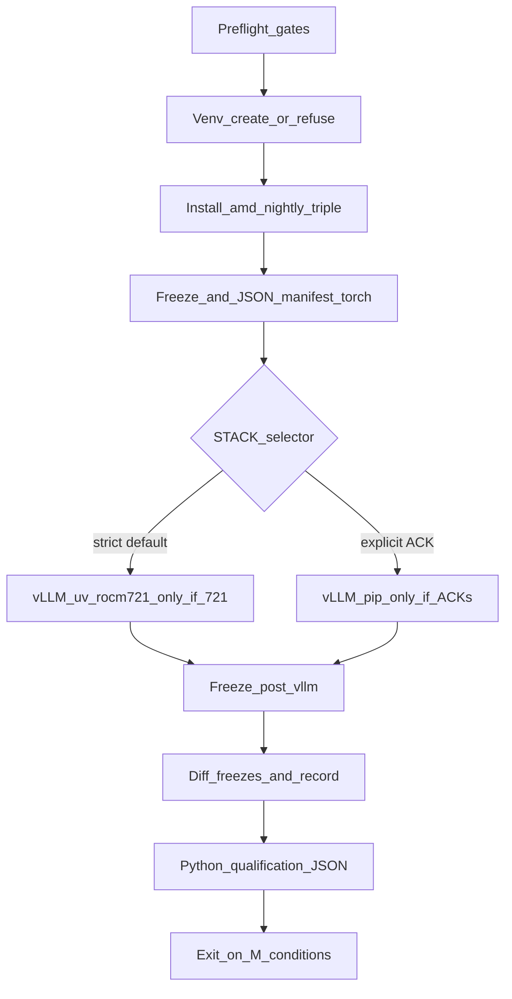

# Reproducible `uv` venv: PyTorch (ROCm 7.2) + vLLM — full runbook

This document and **[`scripts/install_rocm72_uv_torch_vllm.sh`](../scripts/install_rocm72_uv_torch_vllm.sh)** are the **canonical** way to recreate the same Python stack on a **new VM or fresh container** every time. Read this once end-to-end before relying on a one-liner.

**Project benchmark standard (locked MI300X + vLLM):** all future GPU / vLLM benchmark runs in this repo are expected to use the interpreter and artifacts under **`<repo>/.benchmark_mi300_vllm_frozen/`**, documented with exact commands and versions in **[`docs/benchmark_mi300_locked_env.md`](benchmark_mi300_locked_env.md)**. The installer’s default **`ROCM72_UV_WORKDIR`** matches that path unless you override it.

---

## 1. What you are building

| Layer | Source | Notes |
|-------|--------|--------|
| Python | **3.12** in a **new** `uv` venv | `--seed` installs `pip` into the venv |
| PyTorch stack | **One** index: `https://download.pytorch.org/whl/nightly/rocm7.2` | AMD-documented ROCm 7.2 nightly line; `torch` + `torchvision` + `torchaudio` **together** |
| vLLM | Only when **`ROCM72_UV_STACK`** is **`strict_uv_vllm_721`** or **`pip_owned_vllm_721`** | **`rocm721`** wheels are documented for **ROCm 7.2.1**; there is **no** silent `pip + rocm721` path on **7.2.0** without an explicit ACK (see §4). |

**Important:** vLLM’s ROCm wheel often **repins** `torch` / `torchvision` / `torchaudio` when installed with **`pip`** (expected). **`uv pip install vllm`** may **fail** because of **URL/git dependencies** (e.g. `fastsafetensors`). The installer records **`toolchain_steps`** in **`stack_manifest.json`** and only crosses **uv → pip** when **`ROCM72_UV_ALLOW_PIP_FALLBACK=YES`** with **`ROCM72_UV_ACK_VLLM_PIP_REPINS_TORCH=YES`**, or when you choose **`pip_owned_vllm_721`** with the ACK env vars in §4.

---

## 2. Preconditions (new VM or new container)

### 2.1 Machine role

- **Host VM:** needs Docker (or Podman), GPU driver, and access to an MI300X (or your target AMD GPU) if you want `torch.cuda.is_available()`.
- **Inside the GPU container:** must already expose **ROCm 7.2.x** under **`/opt/rocm`**. The install script **does not** install ROCm, **does not** `docker pull`, and **does not** start the container.

### 2.2 Container entry (this repo)

From the **host**, enter the working ROCm 7.2 GPU image and mount the repo (paths may differ):

```bash
bash docker_run_amd_mi300x.sh -- bash -lc 'cd /workspace/amd-experiments && bash'
```

Inside that shell you should have:

```bash
test -d /opt/rocm && cat /opt/rocm/.info/version
ls -l /dev/kfd /dev/dri 2>/dev/null || true
rocm-smi --showproductname 2>/dev/null || rocm-smi
```

### 2.3 Tools inside the container

| Tool | Why |
|------|-----|
| **`curl`**, **`grep`** | Script discovers the current **`rocm…`** nightly folder name on `wheels.vllm.ai` for the **`strict_uv_vllm_721`** path |
| **`uv`** | Create venv + `uv pip` for PyTorch |
| **`python3.12`** | Used by `uv venv --python 3.12` |

Install **`uv`** if missing:

```bash
curl -LsSf https://astral.sh/uv/install.sh | sh
export PATH="$HOME/.local/bin:$PATH"
uv --version
```

### 2.4 Network

Allow outbound HTTPS to:

- `download.pytorch.org` (PyTorch ROCm wheels, **multi‑GB**)
- `wheels.vllm.ai` (vLLM ROCm wheels)
- PyPI (transitive deps when using `pip` for vLLM)

### 2.5 Clean slate (recommended on a new VM)

To avoid mixing with an old venv:

```bash
export ROCM72_UV_WORKDIR=/workspace/amd-experiments/.benchmark_mi300_vllm_frozen   # or your path
rm -rf "$ROCM72_UV_WORKDIR"
```

Default workdir if **`ROCM72_UV_WORKDIR`** is unset: **`<repo>/.benchmark_mi300_vllm_frozen`** (same as the locked benchmark env in **`docs/benchmark_mi300_locked_env.md`**).

---

## 3. One-command install (inside container, repo = cwd)

**Required:** set **`ROCM72_UV_STACK`** to one of **`torch_only`**, **`strict_uv_vllm_721`**, or **`pip_owned_vllm_721`**. There is no `auto` default.

```bash
cd /path/to/amd-experiments
export ROCM72_UV_STACK=torch_only   # or strict_uv_vllm_721 / pip_owned_vllm_721
bash scripts/install_rocm72_uv_torch_vllm.sh
```

Preflight **without** downloads (still requires **`ROCM72_UV_STACK`**, `/opt/rocm`, and **`uv`**):

```bash
export ROCM72_UV_STACK=torch_only
bash scripts/install_rocm72_uv_torch_vllm.sh --gates-only
```

**CLI flags:** **`--fresh`** sets **`ROCM72_UV_FORCE=1`**. **`--resume-qualify-only`** (or env **`ROCM72_UV_RESUME_QUALIFY_ONLY=1`**) re-runs **`uv pip freeze`**, regenerates **`stack_manifest.json`**, and re-runs qualification **without** reinstalling packages; requires an existing **`freeze_torch_only.txt`** from a prior run.

---

## 4. Environment variables (complete)

| Variable | Default | Meaning |
|----------|---------|---------|
| `ROCM72_UV_STACK` | *(none — required)* | **`torch_only`** — AMD nightly torch triple only. **`strict_uv_vllm_721`** — ROCm **7.2.1** only; vLLM via **`uv pip`**; torch pins must not drift vs **`freeze_torch_only.txt`**. **`pip_owned_vllm_721`** — vLLM via **`pip`** from **`rocm721`** nightlies; torch* **may** repin; requires ACKs below. |
| `ROCM72_UV_WORKDIR` | `<repo>/.benchmark_mi300_vllm_frozen` | Directory for `.venv` and all artifacts (project benchmark standard; override only for experiments) |
| `ROCM72_UV_FORCE` / `--fresh` | `0` | If **`$WORKDIR/.venv`** already exists, the script **exits 1** unless **`ROCM72_UV_FORCE=1`** or **`--fresh`**. |
| `ROCM72_UV_ACK_VLLM_PIP_REPINS_TORCH` | *(unset)* | Must be **`YES`** for **`pip_owned_vllm_721`**, and for **`ROCM72_UV_ALLOW_PIP_FALLBACK=YES`** after a failed uv vLLM install. |
| `ROCM72_UV_ACK_ROCM720_USES_ROCM721_WHEEL` | *(unset)* | Must be **`YES`** when using **`pip_owned_vllm_721`** on ROCm **7.2.0** (or any **7.2.x** that is not the **7.2.1** patchline used for `strict_uv_vllm_721`). |
| `ROCM72_UV_ALLOW_PIP_FALLBACK` | *(unset)* | If **`YES`** (with **`ROCM72_UV_ACK_VLLM_PIP_REPINS_TORCH=YES`**), **`strict_uv_vllm_721`** may continue with **`pip install vllm`** after **`uv pip install vllm`** fails. |
| `ROCM72_UV_ALLOW_NON_MI300_GPU` | `0` | Set to **`1`** to allow a GPU whose name does not contain **`MI300`** (stderr warning). |
| `ROCM72_UV_QUALIFY_WAIVE_DECODE` | `0` | Set to **`1`** to pass **`--skip-decode --waive-decode`** to the qualifier (marks **`benchmark_ready`** without running decode; not the default for benchmark-grade stacks). |
| `ROCM72_QUALIFY_MODEL` | `facebook/opt-125m` | HF id for optional vLLM decode smoke. |
| `SKIP_VLLM` | `0` | **Deprecated:** treated as **`ROCM72_UV_STACK=torch_only`** with a warning. |
| `ROCM72_UV_VLLM_MODE` | *(unset)* | **Deprecated:** **`off`→torch_only**, **`uv`→strict_uv_vllm_721**, **`pip`→pip_owned_vllm_721** if **`ROCM72_UV_STACK`** is unset; **`auto`** is **removed** (hard error if it would have applied). |

Examples:

```bash
# AMD nightly torch only on ROCm 7.2.0 lab images (no vLLM)
export ROCM72_UV_STACK=torch_only
bash scripts/install_rocm72_uv_torch_vllm.sh

# vLLM with pip + rocm721 on ROCm 7.2.0 (explicit ACKs)
export ROCM72_UV_STACK=pip_owned_vllm_721
export ROCM72_UV_ACK_VLLM_PIP_REPINS_TORCH=YES
export ROCM72_UV_ACK_ROCM720_USES_ROCM721_WHEEL=YES
bash scripts/install_rocm72_uv_torch_vllm.sh
```

---

## 5. What the script does (step-by-step)

1. **Gates:** `/opt/rocm` exists; **`/opt/rocm/.info/version`** readable; version matches **`7.2.*`**; **`uv`** on **`PATH`**; **`ROCM72_UV_STACK`** valid; stack-specific ROCm / ACK rules (see §4).
2. **Refuse accidental reuse:** if **`$WORKDIR/.venv`** exists and **`ROCM72_UV_FORCE!=1`**, exit **1** (unless **`--resume-qualify-only`**).
3. **`uv venv --python 3.12 --seed`** in **`$ROCM72_UV_WORKDIR`** (when not resuming qualify-only).
4. **`uv pip install --pre torch torchvision torchaudio`** with **`--index-url https://download.pytorch.org/whl/nightly/rocm7.2`** only.
5. **Validate** `torch`: not CUDA (`+cu*`); **`torch.version.hip`** non-empty; **`torch.cuda.is_available()`**; default **MI300** name check.
6. **Write** **`freeze_torch_only.txt`**, **`pytorch_rocm72_manifest.txt`** (compat copy of the torch-only freeze).
7. **vLLM** per **`ROCM72_UV_STACK`** (see §6); write **`freeze_post_install.txt`** and **`freeze_diff.patch`**; enforce **no torch drift** for successful **uv** path on **`strict_uv_vllm_721`**.
8. **`stack_manifest.json`** (partial, then merged with qualification summary).
9. **`scripts/qualify_rocm72_vllm_stack.py`** → **`qualification_report.json`** (torch, optional vLLM import + decode smoke, **`rocprof` / `rocprofv2`** on **`PATH`**).
10. **`install_rocm72_uv_report.txt`** — human snapshot.

Final **exit 0** only if qualification matches the policy (**`0`** required for vLLM stacks unless decode is explicitly waived per env above).

---

## 6. vLLM stacks vs ROCm 7.2.0 vs 7.2.1

### 6.1 Official matrix reminder

- vLLM documents **prebuilt ROCm 7.2.1** wheels under variant **`rocm721`** ([vLLM GPU install](https://docs.vllm.ai/en/latest/getting_started/installation/gpu.html)).
- **`strict_uv_vllm_721`** requires the container **`/opt/rocm/.info/version`** to match the **7.2.1** patchline (implementation rejects **7.2.10** as **7.2.1** — only **`7.2.1`**, **`7.2.1-*`**, etc.).
- **`pip_owned_vllm_721`** on **7.2.0** remains **allowed** only with **`ROCM72_UV_ACK_ROCM720_USES_ROCM721_WHEEL=YES`** (and the pip-repin ACK).

### 6.2 Selector summary

| `ROCM72_UV_STACK` | ROCm | vLLM install | Torch drift vs AMD baseline |
|-------------------|------|--------------|-----------------------------|
| **`torch_only`** | **`7.2.*`** | Not installed | N/A |
| **`strict_uv_vllm_721`** | **7.2.1 patchline only** | **`uv pip install vllm`** (+ discovered **`rocm…`** extra index) | **Forbidden** after successful uv install |
| **`pip_owned_vllm_721`** | **`7.2.*`** with ACKs | **`pip install vllm`** from **`rocm721`** nightlies | **Expected** — recorded in **`freeze_diff.patch`** |

### 6.3 Why `pip` replaces `torch` (documented, not a bug)

When vLLM is installed with **`pip`** from the ROCm wheel index, the resolver may **replace** the AMD nightly **`torch`** stack with the build vLLM’s wheel depends on. Archive **`freeze_torch_only.txt`** and **`freeze_post_install.txt`** (and **`freeze_diff.patch`**) for audits.

### 6.4 Why `uv pip install vllm` can fail

`uv` may error with URL/git dependencies (e.g. **`fastsafetensors`**). The installer **does not** silently fall back to **`pip`**. Use **`ROCM72_UV_ALLOW_PIP_FALLBACK=YES`** with **`ROCM72_UV_ACK_VLLM_PIP_REPINS_TORCH=YES`**, or choose **`pip_owned_vllm_721`** with the ACK env vars.

### 6.5 `stack_id` values in **`stack_manifest.json`**

| `stack_id` | When |
|------------|------|
| **`amd_rocm72_nightly_torch_triple`** | **`torch_only`** |
| **`vllm_uv_rocm721_preserved_amd_torch`** | **`strict_uv_vllm_721`** completed via **uv** (or started as strict and recorded before a documented fallback — see manifest **`vllm_install_method`**) |
| **`vllm_pip_rocm721_owned_torch`** | **`pip_owned_vllm_721`**, or **`strict_uv_vllm_721`** after operator-allowed **pip** fallback |

---

## 7. Artifacts (check into `results/` for long-term audits)

All paths are under **`$ROCM72_UV_WORKDIR`** (default **`<repo>/.benchmark_mi300_vllm_frozen/`**).

| File | Purpose |
|------|---------|
| **`freeze_torch_only.txt`** | Sorted **`uv pip freeze`** after the AMD nightly torch triple |
| **`freeze_post_install.txt`** | Sorted freeze after all installs (for **`torch_only`**, a copy of the torch-only freeze) |
| **`freeze_diff.patch`** | **`diff -u freeze_torch_only.txt freeze_post_install.txt`** |
| **`stack_manifest.json`** | **`stack_id`**, **`wheel_class`**, versions, HIP, GPU, **`toolchain_steps`**, **`qualification_summary`**, etc. |
| **`qualification_report.json`** | Per-check JSON from **`scripts/qualify_rocm72_vllm_stack.py`** |
| **`install_rocm72_uv_report.txt`** | Human-readable snapshot |
| **`install_state.json`** | Written on **installer failure** (`failed` + reason) |
| **`pytorch_rocm72_manifest.txt`** | Back-compat copy of **`freeze_torch_only.txt`** |

**Compare two installs:**

```bash
cd "$ROCM72_UV_WORKDIR"
diff -u freeze_torch_only.txt /path/to/old/freeze_torch_only.txt
diff -u freeze_post_install.txt /path/to/old/freeze_post_install.txt
```

**Optional:** after a successful run:

```bash
d=$(date -u +%Y%m%dT%H%M%SZ)
cp "$ROCM72_UV_WORKDIR/freeze_post_install.txt" "results/rocm72_uv_stack_${d}.txt"
cp "$ROCM72_UV_WORKDIR/stack_manifest.json" "results/rocm72_stack_manifest_${d}.json"
cp "$ROCM72_UV_WORKDIR/install_rocm72_uv_report.txt" "results/rocm72_uv_report_${d}.txt"
```

---

## 8. Activate and verify (copy-paste)

```bash
source "$ROCM72_UV_WORKDIR/.venv/bin/activate"   # default: .benchmark_mi300_vllm_frozen/.venv
python - <<'PY'
import sys, torch, torchvision, torchaudio
print("python", sys.version.split()[0])
print("torch", torch.__version__, "hip", torch.version.hip, "cuda?", torch.cuda.is_available())
print("torchvision", torchvision.__version__)
print("torchaudio", torchaudio.__version__)
try:
    import vllm
    print("vllm", vllm.__version__)
except Exception as e:
    print("vllm", "n/a", e)
PY
```

---

## 9. Failure cases (symptom → fix)

| Symptom | Cause | Fix |
|---------|--------|-----|
| `Set ROCM72_UV_STACK` | Missing required selector | Export **`ROCM72_UV_STACK`** to **`torch_only`**, **`strict_uv_vllm_721`**, or **`pip_owned_vllm_721`** |
| `Refusing to reuse …/.venv` | Rerun without **`FORCE`** | `rm -rf "$ROCM72_UV_WORKDIR"` or **`ROCM72_UV_FORCE=1`** / **`--fresh`** |
| `/opt/rocm` missing | Not in ROCm container | Use `docker_run_amd_mi300x.sh` or AMD ROCm dev image |
| `strict_uv_vllm_721 requires ROCm 7.2.1` | Stack vs image mismatch | Use **`torch_only`**, **`pip_owned_vllm_721`** with ACKs, or a **7.2.1** image |
| `ACK … YES` errors | **`pip_owned_vllm_721`** without ACKs | Set the ACK env vars documented in §4 |
| `uv: command not found` | PATH | §2.3 |
| `torch.version.hip` empty / `+cu*` in version | CUDA PyTorch leaked in | Delete workdir; rerun; never mix extra indices |
| `operator torchvision::nms does not exist` | `torch`/`torchvision` from different lines | Same as above — reinstall from **one** ROCm index |
| `uv pip install vllm` fails (URL dep) | uv resolver limitation | **`ROCM72_UV_ALLOW_PIP_FALLBACK=YES`** + repin ACK, or **`ROCM72_UV_STACK=pip_owned_vllm_721`** |
| `torch/vision/audio pins changed after uv vLLM` | Drift on preserved stack | Fix wheel indices; do not use **`strict_uv_vllm_721`** if you need pip repins |
| `Qualification failed` | Decode / import / MI300 policy | Read **`qualification_report.json`**; optional **`ROCM72_UV_QUALIFY_WAIVE_DECODE=1`** |
| `torch.cuda.is_available()` False | GPU not passed to container | [`docs/mi300x_docker_runtime_requirements.md`](mi300x_docker_runtime_requirements.md) |

---

## 10. After vLLM: TurboQuant in **this** repo

```bash
bash scripts/install_turboquant_vllm_backend.sh
export PYTHONPATH="/path/to/amd-experiments/kernels${PYTHONPATH:+:$PYTHONPATH}"
```

Details: [`docs/vllm_turboquant_wiring.md`](vllm_turboquant_wiring.md).

---

## 11. Official upstream docs (do not guess wheels)

- [AMD — PyTorch on ROCm installation (7.2.1 doc set)](https://rocm.docs.amd.com/projects/install-on-linux/en/docs-7.2.1/install/3rd-party/pytorch-install.html)
- [AMD — PyTorch compatibility overview](https://rocm.docs.amd.com/en/docs-7.2.1/compatibility/ml-compatibility/pytorch-compatibility.html)
- [vLLM — GPU installation (ROCm wheels, source build)](https://docs.vllm.ai/en/latest/getting_started/installation/gpu.html)

---

## 12. New VM checklist (order matters)

1. [ ] GPU host + Docker OK; `docker_run_amd_mi300x.sh` (or equivalent) runs.
2. [ ] Clone / mount **`amd-experiments`** in the container at a stable path.
3. [ ] `cat /opt/rocm/.info/version` → note **7.2.0 vs 7.2.1** in your lab notes.
4. [ ] Install **`uv`** (§2.3); choose **`ROCM72_UV_STACK`**; **`bash scripts/install_rocm72_uv_torch_vllm.sh --gates-only`** passes.
5. [ ] `rm -rf` old **`ROCM72_UV_WORKDIR`** if re-provisioning (or plan **`ROCM72_UV_FORCE=1`**).
6. [ ] Run **`ROCM72_UV_STACK=… bash scripts/install_rocm72_uv_torch_vllm.sh`** (15–60+ minutes depending on cache).
7. [ ] Archive **`stack_manifest.json`**, **`freeze_post_install.txt`**, and **`install_rocm72_uv_report.txt`** to **`results/`** with a UTC timestamp.
8. [ ] Run §8 verification block; run your benchmark script.
9. [ ] If TurboQuant: §10.

---

## 13. CI / sandboxes

Ephemeral CI often has **no GPU** and **no ROCm**. **`--gates-only`** is the lightest check; it still requires **`ROCM72_UV_STACK`**, **`/opt/rocm`**, **`uv`**, and **stack-vs-ROCm ACK rules** (so e.g. **`strict_uv_vllm_721`** fails on **7.2.0** even in gates-only mode). Full installs are validated on **real ROCm 7.2 GPU containers**.

---

## 14. Benchmark-grade gap analysis (historical audit A–N)

This section records the **pre-hardening** audit items **A–N**. The current **`scripts/install_rocm72_uv_torch_vllm.sh`** + **`scripts/qualify_rocm72_vllm_stack.py`** implement the mitigations described in §15–§18 and §3–§9 above.

| ID | Topic | Current weakness |
|----|--------|-------------------|
| A | Wheel-line / ROCm patch | `ROCM72_UV_VLLM_MODE=auto` **silently** uses **pip + `rocm721`** on **ROCm 7.2.0**. vLLM documents **`rocm721` for ROCm 7.2.1** — that is **not** a clean supported line for 7.2.0 without an explicit operator decision. |
| B | Resolver drift | **Pip** vLLM path **intentionally** repins `torch*` but the script does not persist a **structured diff** of `uv pip freeze` before vs after, nor a **named stack identity** file consumed by benchmarks. |
| C | Import vs runtime | Only import-style checks in bash; **no** minimal **GPU decode** through vLLM; success can still hide runtime/kernel issues. |
| D | Host/container capture | Partial (`install_rocm72_uv_report.txt`); missing **`which python`**, full **`uv version`**, **`env` subset**, **`rocminfo | gfx`** snapshot, explicit **venv path == target** assertion. |
| E | Machine-readable artifacts | Text freezes only; **no single `stack_manifest.json`** with versions + HIP + GPU + **stack_id** + **wheel_class=nightly\|pip_owned\|torch_only**. |
| F | Stack identity | Three stacks (AMD nightly baseline, vLLM-UV-preserved, vLLM-pip-owned) are **not** labeled in a single canonical field for downstream JSON benches. |
| G | Unsupported silence | **7.2.0 + auto + pip** is a **weakly documented** combination presented as automatic — should **fail** or require **explicit ACK** env var. |
| H | Nightly classification | Script does not emit **`wheel_line: pytorch_nightly_rocm7.2`** vs **`vllm_rocm721_nightly`** in machine-readable form. |
| I | Benchmark readiness | No **vLLM decode smoke**, no **rocprof** binary preflight beyond implicit PATH; no separation of **install_complete** vs **benchmark_ready**. |
| J | Rerun / mutation | **No `ROCM72_UV_FORCE`**: rerunning can **mutate** an existing `.venv` without comparing to a prior manifest baseline. |
| K | Mixed toolchain | **uv** then **pip** without a **single declared transition** artifact; operator can misread logs. |
| L | URL deps / half state | **uv** failure falls back to **pip** but there is no **staged rollback** of partial vLLM packages on failure mid-pip. |
| M | Success criteria | Exit **0** when `SKIP_VLLM=1` even if user expected full stack; final block treats **NOT_IMPORTABLE** as non-fatal for vLLM. |
| N | Documentation | This file documents modes, but **does not yet** mirror the stricter **ACK / STACK_ID / qualification JSON** contract (sections **15–18** fix that spec-side). |

---

## 15. Improved design (target behavior)

### 15.1 Stack identities (`stack_id`) — never ambiguous

| `stack_id` | Meaning | Torch owner | vLLM | ROCm gate |
|------------|---------|-------------|------|-----------|
| `amd_rocm72_nightly_torch_triple` | `torch`+`vision`+`audio` from **only** `https://download.pytorch.org/whl/nightly/rocm7.2` | **AMD nightly line** | **Not installed** | `7.2.*` |
| `vllm_uv_rocm721_preserved_amd_torch` | vLLM via **`uv pip`** from `wheels.vllm.ai/rocm/nightly/<variant>` | **Still AMD nightly** (torch pin lines must match **`freeze_torch_only.txt`**) | Installed | **7.2.1** patchline only (**`strict_uv_vllm_721`**) |
| `vllm_pip_rocm721_owned_torch` | vLLM via **`pip`** from `rocm721` nightlies | **vLLM wheel pins** (torch* **will** change) | Installed | **`ROCM72_UV_ACK_VLLM_PIP_REPINS_TORCH=YES`** always; plus **`ROCM72_UV_ACK_ROCM720_USES_ROCM721_WHEEL=YES`** when ROCm is not the **7.2.1** patchline (see §4) |

**Rule:** default path must **not** enter `vllm_pip_rocm721_owned_torch` without ACKs. **No** `rocm721` pip wheel on **7.2.0** without **`ROCM72_UV_ACK_ROCM720_USES_ROCM721_WHEEL=YES`**.

### 15.2 Installer phases (deterministic)



### 15.3 Qualification (separate from “pip exit 0”)

- **Install complete:** torch triple validated (HIP, not CUDA, GPU visible for MI300X policy).
- **Runtime qualified:** `scripts/qualify_rocm72_vllm_stack.py` writes **`qualification_report.json`** with per-check booleans.
- **Benchmark ready:** decode smoke **passed**, or decode skipped with an explicit operator waiver (**`ROCM72_UV_QUALIFY_WAIVE_DECODE=1`**) so **`qualification_report.json`** still marks **`benchmark_ready: true`** while noting the waiver (never silent).

### 15.4 rocprof preflight

Log presence of `rocprof` / `rocprofv2` on `PATH` into **`qualification_report.json`** and the merged **`qualification_summary`** in **`stack_manifest.json`**. **Do not** run a full capture in the installer (too heavy); benchmarks remain responsible for rocprof collection.

---

## 16. Environment contract (strict / explicit ACK)

| Variable | Required when | Purpose |
|----------|---------------|---------|
| `ROCM72_UV_FORCE=1` | Reusing a non-empty `$WORKDIR/.venv` | Refuses accidental mutation without operator intent |
| `ROCM72_UV_STACK` | Always (no default) | **`torch_only`** \| **`strict_uv_vllm_721`** \| **`pip_owned_vllm_721`** |
| `ROCM72_UV_ACK_VLLM_PIP_REPINS_TORCH=YES` | `pip_owned` / pip vLLM path | Operator accepts torch* repinning |
| `ROCM72_UV_ACK_ROCM720_USES_ROCM721_WHEEL=YES` | ROCm **7.2.0** + any `rocm721` wheel | Acknowledge doc mismatch vs vLLM’s **7.2.1** row |
| `ROCM72_UV_ALLOW_PIP_FALLBACK=YES` | **`strict_uv_vllm_721`** after **`uv pip install vllm`** fails | Allow documented **uv → pip** transition (requires repin ACK) |

**Default recommendations for MI300X + Primus (`7.2.0`):** (1) **`ROCM72_UV_STACK=torch_only`** if you need AMD nightly torch only; (2) **`ROCM72_UV_STACK=pip_owned_vllm_721`** with both ACK env vars if you need **vLLM on 7.2.0** (this is the **locked benchmark stack** — see **`docs/benchmark_mi300_locked_env.md`**); (3) move to a **ROCm 7.2.1** image for **`strict_uv_vllm_721`** if you want UV-preserved torch + vLLM without pip repin.

---

## 17. Artifacts after revision (machine-readable)

| File | Content |
|------|---------|
| `stack_manifest.json` | `stack_id`, `wheel_class`, `rocm_ver`, python, uv, torch/vision/audio versions, vllm version or null, HIP, GPU, timestamps |
| `freeze_torch_only.txt` | `uv pip freeze` after torch |
| `freeze_post_install.txt` | `uv pip freeze` after all installs |
| `freeze_diff.patch` | `diff -u` freezes (empty if torch-only) |
| `qualification_report.json` | Output from qualify script |
| `install_rocm72_uv_report.txt` | Human summary + exit semantics |

Final script exit code **must** be non-zero if **qualification** fails or **unexpected torch drift** occurs in **`strict`** / UV-preserved mode.

---

## 18. Intentional hard failures (loud)

1. **`/opt/rocm/.info/version` not `7.2.*`** → exit 1.  
2. **Python in venv not 3.12.x** → exit 1.  
3. **`torch` is CUDA (`+cu`) or `hip` empty** → exit 1.  
4. **`torch.cuda.is_available()` false** on the default MI300X path → exit 1 (escape hatch: **`ROCM72_UV_ALLOW_NON_MI300_GPU=1`** for non-MI300 GPUs).  
5. **`ROCM72_UV_STACK=strict_uv_vllm_721` + ROCm not on the 7.2.1 patchline** → exit 1 (“use **torch_only** / **pip_owned**+ACKs / 7.2.1 image”).  
6. **Post-install torch drift** when the preserved **uv** path applies → exit 1.  
7. **Qualification** returns non-**`0`** for vLLM stacks (or **`torch_only`** failure) → exit 1.  
8. **Existing `.venv` without `ROCM72_UV_FORCE=1`** → exit 1.

---

## 19. Implementation status

The hardened installer and qualifier live in-repo as:

- [`scripts/install_rocm72_uv_torch_vllm.sh`](../scripts/install_rocm72_uv_torch_vllm.sh)  
- [`scripts/qualify_rocm72_vllm_stack.py`](../scripts/qualify_rocm72_vllm_stack.py)

See §3–§9 for the operator contract; §15–§18 for design rationale.

---

## 20. Qualifier exit codes

| Exit | Meaning |
|------|---------|
| **0** | **`benchmark_ready`** (torch OK; for vLLM stacks: import + decode smoke passed, or decode skipped **with** **`--waive-decode`**) |
| **2** | Soft: e.g. decode skipped **without** waiver — not benchmark-ready |
| **1** | Hard fail (bad torch / HIP / GPU / import errors) |

The installer treats non-**`0`** qualification as a **fatal error** for **`torch_only`** and for vLLM stacks unless you use the explicit decode waiver env in §4.

---

## 21. Installer behavior summary (bash)

1. Require **`ROCM72_UV_STACK`**; warn on deprecated **`SKIP_VLLM`** / **`ROCM72_UV_VLLM_MODE`**.  
2. Refuse existing **`.venv`** unless **`ROCM72_UV_FORCE=1`** or **`--fresh`**.  
3. After torch: **`freeze_torch_only.txt`** (+ compat **`pytorch_rocm72_manifest.txt`**).  
4. No silent **`auto → pip`** on 7.2.0; pip **`rocm721`** on 7.2.0 requires **`ROCM72_UV_ACK_ROCM720_USES_ROCM721_WHEEL=YES`**.  
5. **`uv` → `pip`** fallback only with **`ROCM72_UV_ALLOW_PIP_FALLBACK=YES`** and repin ACK.  
6. After vLLM (if any): **`freeze_post_install.txt`**, **`freeze_diff.patch`**, drift enforcement for the preserved **uv** path.  
7. Invoke **`qualify_rocm72_vllm_stack.py`**; merge summary into **`stack_manifest.json`**.  
8. Exit **non-zero** on failed gates, failed installs, drift violations, or failed qualification.

---

## 22. rocprof / further benchmark checks (explicitly out of scope for installer)

Even with a passing decode smoke: **rocprof timeline**, **TurboQuant backend**, and **scheduler sweeps** remain **benchmark-owned** steps. The installer only records **binary presence** on `PATH`.
