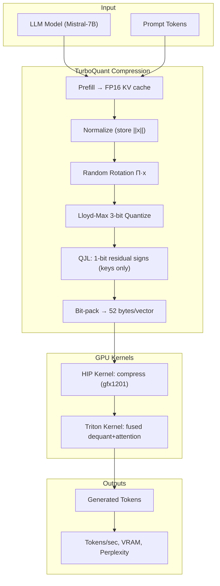

# AMD ROCm TurboQuant Implementation & Benchmarking Plan

## Key Research Findings

**Algorithm** (Google Research, ICLR 2026):
- PolarQuant: random orthogonal rotation → Lloyd-Max scalar quantization (3-bit, 8 centroids)
- QJL: 1-bit sign-based residual correction for keys only
- Result: 4.9× compression at 3-bit, zero accuracy loss, works without retraining

**Existing CUDA implementation**: [DevTechJr/turboquant-gpu](https://github.com/DevTechJr/turboquant-gpu) uses NVIDIA cuTile kernels — not portable to AMD

**Critical existing AMD work**:
- [domvox/turboquant-hip](https://github.com/domvox/turboquant-hip) — HIP kernels for TQ3/TQ4, gfx1100 (RDNA3). This is our starting point.
- [domvox/llama.cpp-turboquant-hip](https://github.com/domvox/llama.cpp-turboquant-hip) — full llama.cpp integration
- Neither targets gfx1201 (RDNA4) yet

**Target GPU**: RX 9060 XT — 320 GB/s bandwidth (10× less than H100). This makes compression MORE valuable on this hardware; estimated crossover at ~1K–2K tokens.

**RDNA4 ecosystem status** (ROCm 6.4.1):
- Triton attention kernels work (`FLASH_ATTENTION_TRITON_AMD_ENABLE=TRUE`, merged vLLM PR #32944)
- FP8 KV cache works in vLLM (PR #34741) — our baseline
- AITER not yet supported; CK Flash Attention is CDNA-only
- Use ROCm 6.4.1 (7.2.1 has VRAM regression for quantized KV)

## Architecture

## Implementation Phases

### Phase 0: Environment (Days 1–2)
- Install ROCm 6.4.1, PyTorch ROCm, Triton on Ubuntu 24.04
- Verify gfx1201 detected: `rocminfo | grep gfx1201`
- Set env: `FLASH_ATTENTION_TRITON_AMD_ENABLE=TRUE`, `PYTORCH_TUNABLEOP_ENABLED=1`
- Models: Mistral-7B-v0.1 (primary), Llama-3.2-3B (secondary)

### Phase 1: Baselines (Days 3–5)
Benchmark `seq_len ∈ {512, 1024, 2048, 4096, 8192, 16384}` for:
- `fp16` — standard PyTorch KV cache
- `fp8_e4m3` — software FP8 cast (vLLM paged attention PR #34741 path)
- `int4_naive` — manual nibble packing, no fused kernel

Collect: tokens/sec, VRAM peak, perplexity (WikiText-103, 50 samples)

### Phase 2: HIP Port to gfx1201 (Days 6–10)
- Clone `domvox/turboquant-hip`, recompile with `--offload-arch=gfx1201`
- Most code works unchanged (both gfx1100 and gfx1201 are Wave32 RDNA)
- Validate with the 9-test suite (`./tq_validate`)
- Expose via Python ctypes wrapper or PyTorch C++ extension
- Validation targets: cosine sim > 0.98, MSE < 0.040, no crash at B=16/H=32/S=4096

### Phase 3: Fused Triton Attention Kernel (Days 11–15)
Write a Triton kernel that avoids materializing FP16 KV in global memory:
- Load 3-bit K indices + norms (52 bytes) from VRAM
- Dequantize on-chip: centroid lookup → rotate → scale
- Compute attention scores + QJL correction in registers
- Online softmax (Flash Attention 2 style) with on-chip V dequant
- Autotune: `BLOCK_M ∈ {64,128}`, `BLOCK_N ∈ {64,128}`, `waves_per_eu ∈ {1,2}`
- Fallback: HIP decompress → FP16 scratch → standard Triton FA

### Phase 4: Integration & Full Benchmarks (Days 16–20)
- Patch llama.cpp-turboquant-hip to include gfx1201 in `AMDGPU_TARGETS`
- Run full benchmark matrix: 2 models × 6 seq_lens × 6 kv_configs
- Profile with `rocprof`: FETCH_SIZE, VALUUtilization, MemUnitBusy, L2CacheHit
- Extract kernel time breakdown: attention%, KV load%, dequant%, softmax%

### Phase 5: Analysis & Report (Days 21–25)
Produce 5 plots (tokens/sec vs context length, VRAM vs seq_len, perplexity vs bits, kernel time breakdown, bandwidth utilization). Write `report/final_report.md`.

## Critical Files to Create/Modify

- `kernels/tq_hip.hip.cpp` — gfx1201 HIP kernels (from domvox gfx1100 port)
- `kernels/tq_triton.py` — Triton fused dequant-attention kernel
- `kernels/tq_hip.py` — Python wrapper
- `benchmarks/bench_attention.py` — full benchmark harness
- `benchmarks/bench_quality.py` — perplexity evaluation
- `analysis/plot_*.py` — visualization scripts

## Risks

- LLM inference hangs on ROCm 6.4.1 for some models → use llama.cpp HIP (more stable)
- Triton kernel rotation matmul may be hard to express in a single kernel → use two-pass fallback
- VRAM regression on ROCm 7.2.1 → pin ROCm 6.4.1
- hipBLASLt tuning incomplete for gfx1201 shapes → profile and document gaps
