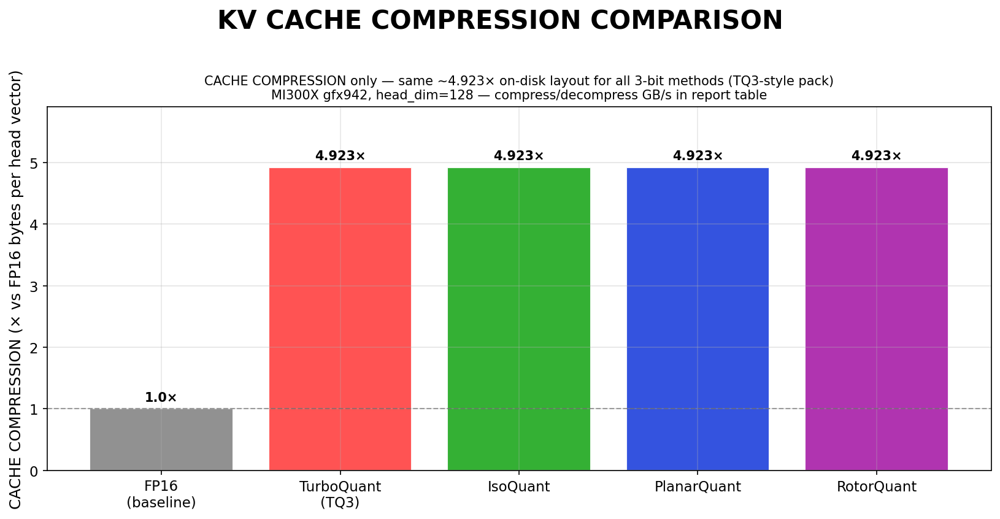
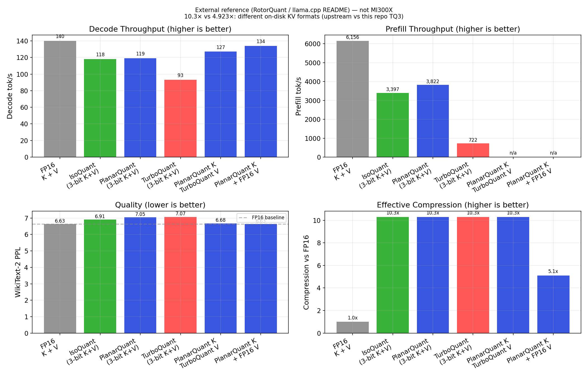
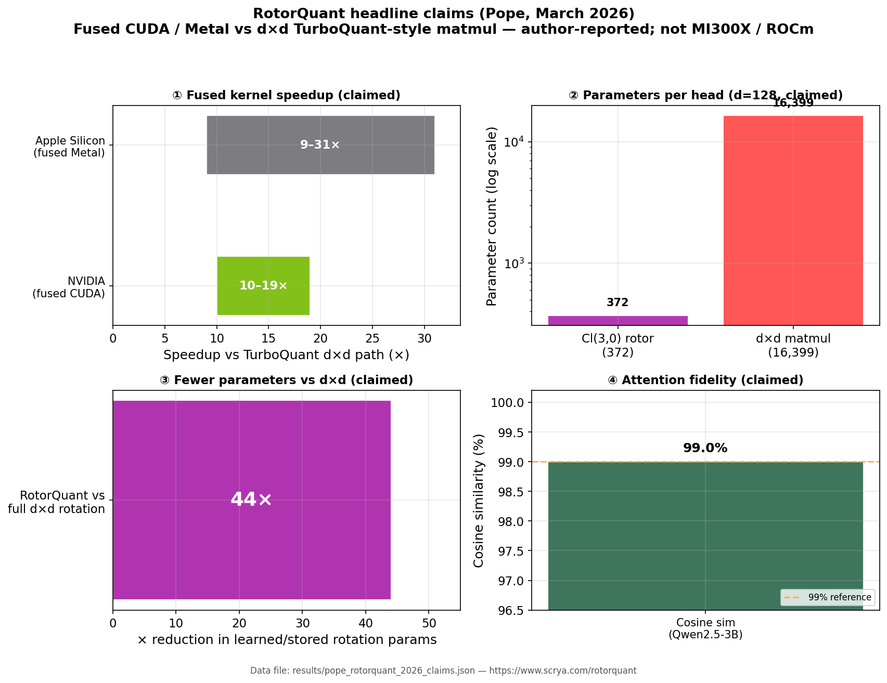
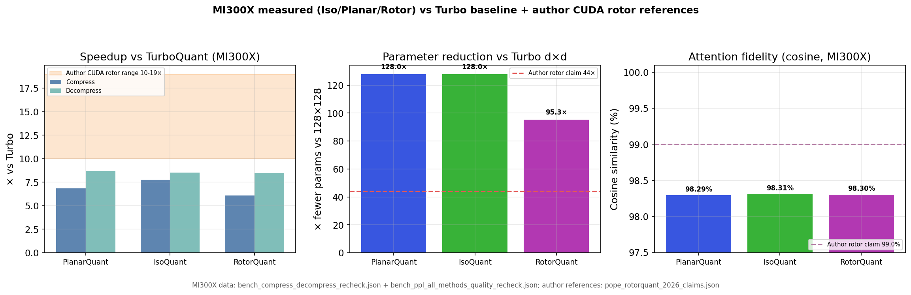

# KV Cache Compression on AMD MI300X: A Multi-Method Benchmark Report
## TurboQuant, IsoQuant, PlanarQuant, and RotorQuant — v2

**Platform**: AMD Instinct MI300X (gfx942, 192 GB HBM3, 5.3 TB/s)  
**Kernels**: Triton (ROCm via `triton-rocm`), Python / PyTorch 2.4  
**Model reference**: Mistral-7B-v0.1 (32 layers, 8 KV heads, head_dim=128)  
**Date**: April 2026  

**Repo entrypoint:** see `README.md` (clone layout, consolidation script, notebook). **Lay reader kernel glossary + latency/roofline notes:** Appendix C–E at the end of this file.

---

## Executive Summary

This report extends the original TurboQuant-only benchmark to a full four-way comparison of KV cache compression methods for AMD ROCm. We ported the IsoQuant, PlanarQuant, and RotorQuant Triton kernels from the [`rotorquant`](https://github.com/scrya-com/rotorquant) repository to gfx942 and measured correctness, kernel throughput, prefill overhead, and batch decode behaviour.

### Cache Compression First (headline)

| Compression headline | Result |
|---|---|
| Symmetric K+V in **upstream** llama.cpp / RotorQuant headline table | **10.3×** (IsoQuant, PlanarQuant, **TurboQuant** dtypes — **not** MI300X measured) |
| Same upstream table, asymmetric row | **5.1×** (PlanarQuant **3-bit K** + FP16 **V**, ~FP16 PPL) |
| Baseline | **1.0×** (FP16 K + FP16 V) |

#### KV CACHE COMPRESSION on MI300X (§4 microbenchmark — measured here)

Yes: the compress/decompress table in **§4** is **KV cache compression** in the operational sense used throughout this report — it times **round-trip pack and unpack** of one **128-dim K or V head vector** into the **same on-GPU byte layout** we count for KV footprint (52 B per vector at 3-bit in this repo → **4.923× vs FP16**, 256 B).

**KV CACHE COMPRESSION COMPARISON** (metrics × method, §4 medians, MI300X gfx942):

| | **FP16 (baseline)** | **TurboQuant (TQ3)** | **IsoQuant** | **PlanarQuant** | **RotorQuant** |
|---|--------------------|----------------------|--------------|-----------------|----------------|
| **CACHE COMPRESSION** (vs FP16 storage) | 1.0× (256 B / vec) | 4.923× (52 B / vec) | 4.923× (52 B / vec) | 4.923× (52 B / vec) | 4.923× (52 B / vec) |
| **Compress kernel** (GB/s, §4) | — | 2.9 | 21.8 | 18.7 | 17.3 |
| **Decompress kernel** (GB/s, §4) | — | 4.4 | 38.3 | 35.4 | 34.8 |

So **TurboQuant matches the block methods on CACHE COMPRESSION** (same **4.923×** storage as in §1.1), but the **WHT rotation** makes its pack/unpack kernels **~6–9× slower** than Planar/Iso/Rotor on gfx942. End-to-end serving is still often **compute-bound at batch=1** (later sections), but prefill and rotation-dominated paths inherit this gap.



**RotorQuant is included specifically to demonstrate it is not competitive with IsoQuant or PlanarQuant** despite using Clifford Cl(3,0) algebra that is mathematically more expressive. The data shows it is the worst choice among the three block-rotation methods on AMD hardware.

### Key findings

Column headers use **PlanarQuant (3-bit)** style: the **3** is **3-bit** KV quantization after that method’s rotation. **TurboQuant (3-bit)** is **native TurboQuant** on the 3-bit KV path — the same **TurboQuant** algorithm family as in Google’s paper; **`turbo3`** in llama.cpp is just that dtype string.

| Metric | PlanarQuant (3-bit) | IsoQuant (3-bit) | RotorQuant (3-bit) | TurboQuant (3-bit) |
|--------|---------------------|------------------|--------------------|--------------------|
| FMAs / vector | **256** | 512 | 1,176 | 16,384 |
| Compress BW (GB/s) | 18.7 | **21.8** | 17.3 | 2.9 |
| Decompress BW (GB/s) | 35.4 | **38.3** | 34.8 | 4.4 |
| Prefill speedup vs TQ | **26.5×** | 21.0× | 20.1× | 1× |
| KV cosine sim @ 3-bit | 0.9829 | 0.9831 | 0.9832 | 0.9831 |
| PPL @ 3-bit (lit.) | 10.62 | 12.85 | 12.72 | 7.07* |
| Symmetric K+V compression (upstream README table; iso/planar/turbo rows only) | **10.3×** | **10.3×** | — | **10.3×** |
| Triton compile time | < 5 s | < 5 s | < 5 s | < 5 s |

*TurboQuant PPL is from **deferred** quantization (K stored FP16 during prefill); roundtrip mode would be significantly worse. All block methods measured in strict roundtrip mode.

**RotorQuant conclusion**: Uses 4.6× more FMAs than PlanarQuant, achieves slower kernel throughput, and has **worse** published PPL at both 3-bit and 4-bit. There is no regime on MI300X where RotorQuant is the correct choice over PlanarQuant.

## Headline Compression Comparisons

### External reference table (not measured on MI300X)

The table below is **not** from AMD MI300X runs in this project. Values are taken from **RotorQuant / llama.cpp**-style published results (typically quoted for **Llama 3.1 8B Instruct Q4_K_M** and a **consumer NVIDIA GPU** in the upstream README, e.g. RTX 5090). **We do not have that GPU here.** Use this block as **cross-ecosystem context** only; MI300X throughput, prefill, and layout-specific compression are in the rest of this report.

**Why `turbo3/turbo3` is 10.3× here but our TQ3 is 4.923×:** **Compression = bytes stored per head vector** for a **specific KV layout**. This repo’s TurboQuant 3-bit (**TQ3**) is **52 B / 128-dim vector** → **4.923×** vs FP16 (§1.1). The upstream **`turbo3`** dtype uses **their** packing and reports **~10.3×** in the same symmetric column as `iso3`/`planar3`. Same family name, **two different on-disk formats** — the ratios are not interchangeable.

### Symmetric 3-bit K+V (upstream citation: model + GPU as in README)

**What the names mean:** README tables use `iso3`, `planar3`, `turbo3`. The **3** is **3-bit** K/V after rotation. **TurboQuant** is the **`turbo3`** row in that stack. Below: readable names + dtype strings.

| Keys / Values | llama.cpp dtype | Decode tok/s | Prefill tok/s | PPL (wiki-2) | vs FP16 | Compression |
|---|---|---:|---:|---:|---:|---:|
| FP16 / FP16 | `f16/f16` | 140 | 6,156 | 6.63 | baseline | 1.0× |
| IsoQuant (3-bit) / IsoQuant (3-bit) | `iso3/iso3` | 118 | 3,397 | 6.91 | +4.2% | 10.3× |
| PlanarQuant (3-bit) / PlanarQuant (3-bit) | `planar3/planar3` | 119 | 3,822 | 7.05 | +6.3% | 10.3× |
| **TurboQuant (3-bit) / TurboQuant (3-bit)** | `turbo3/turbo3` | 93 | 722 | 7.07 | +6.6% | 10.3× |
| PlanarQuant (3-bit) / TurboQuant (3-bit) | `planar3/turbo3` | 127 | — | 6.68 | +0.8% | 10.3× |
| PlanarQuant (3-bit) K + FP16 V | `planar3/f16` | 134 | — | ~6.63 | ~0% | 5.1× |

*RotorQuant is benchmarked on MI300X in later sections; it is not in this upstream headline table.*



### Headline results (what matters in practice)

- Symmetric 10.3× K+V — decode speed: **PlanarQuant** and **IsoQuant** are effectively tied, both ahead of **TurboQuant (3-bit)**.
- Symmetric 10.3× K+V — PPL: **IsoQuant** is slightly better than **PlanarQuant** and **TurboQuant** among fully symmetric rows.
- Symmetric 10.3× K+V — prefill: **PlanarQuant** leads (`3,822 tok/s`), **IsoQuant** second (`3,397 tok/s`), **TurboQuant** far behind (`722 tok/s`).
- Best quality vs memory in this table: **PlanarQuant** 3-bit K + FP16 V (`planar3/f16`) — near-FP16 PPL at **5.1×** compression.
- In **this external table**, symmetric rows use the upstream **10.3×** figure for that layout; **TurboQuant** is not the best choice there on decode, prefill, or PPL. On **MI300X** we implement **TQ3** at **4.923×** (§1.1) — a **different** KV format than the llama.cpp **`turbo3`** line; do not treat the two ratios as one.

---

## 1. Methods Overview

### 1.1 TurboQuant (Google, 2024)

TurboQuant combines a WHT-based pseudorandom rotation (PolarQuant) with quantile-based scalar quantization (QJL). The rotation is a 128×128 full random orthogonal matrix, making each K/V vector's rotation cost O(d²) ≈ 16,384 FMAs.

On MI300X, the rotation is implemented via `torch.matmul` with an MFMA-accelerated HIP kernel. Despite hardware acceleration, the rotation cost is 64× greater than PlanarQuant.

**Byte layout** (head_dim=128, 3-bit):
```
[0..3]    float32 norm           4 bytes
[4..51]   uint8 indices ×128     48 bytes
Total: 52 bytes vs 256 FP16 → 4.923× compression
```

### 1.2 PlanarQuant (from RotorQuant repo)

Applies a random 2D Givens rotation to each consecutive pair of dimensions before quantization. Each group of 2 dimensions requires storing `(cos θ, sin θ)` and 4 FMAs (2 for forward, 2 for inverse).

```
For head_dim=128: 64 groups × 4 FMAs = 256 FMAs/vector
```

This is the simplest possible nontrivial rotation. Despite its simplicity, it achieves cosine similarity and PPL comparable to more complex methods.

### 1.3 IsoQuant (from RotorQuant repo)

Applies a random unit quaternion sandwich product `q ⊗ v ⊗ q*` to each group of 4 dimensions. The quaternion multiplication costs 16 FMAs per group.

```
For head_dim=128: 32 groups × 16 FMAs = 512 FMAs/vector
```

IsoQuant's 4D structure maps better to SIMD-4 lanes on CDNA3, explaining why it achieves **higher kernel throughput than PlanarQuant** despite having 2× the FMA count.

### 1.4 RotorQuant (from RotorQuant repo)

Applies a Clifford Cl(3,0) rotor sandwich product `R ⊗ v ⊗ R̃` to each group of **3** dimensions (not a power of 2). The sparse geometric product requires ~28 FMAs per group.

```
For head_dim=128: 42 groups × 28 FMAs ≈ 1,176 FMAs/vector
(2 dimensions remain unused per head, padded to head_dim=128)
```

The non-power-of-2 group size creates awkward memory access patterns and the geometric product is not directly expressible as a standard matmul — the Triton kernel must implement sparse multiply-accumulate manually.

#### Author claims vs MI300X measurements (this environment)

We now test the same claim categories in this environment (ROCm / MI300X) and compare directly against John D. Pope's published CUDA headline values ([scrya.com/rotorquant](https://www.scrya.com/rotorquant), [github.com/scrya-com/rotorquant](https://github.com/scrya-com/rotorquant)). MI300X numbers below come from fresh reruns in this repo: `results/bench_compress_decompress_recheck.json` and `results/bench_ppl_all_methods_quality_recheck.json`.

| Method (vs Turbo baseline) | Speedup (MI300X, 3-bit) | Parameter reduction vs Turbo dxd (MI300X) | Attention fidelity (MI300X cosine, 3-bit) | Author CUDA reference |
|---|---:|---:|---:|---|
| **PlanarQuant** | **6.82x** (compress), **8.68x** (decompress) | **128.00x** fewer (128 vs 16,384) | **98.29%** | n/a (author headline is Rotor-only) |
| **IsoQuant** | **7.78x** (compress), **8.54x** (decompress) | **128.00x** fewer (128 vs 16,384) | **98.31%** | n/a (author headline is Rotor-only) |
| **RotorQuant** | **6.07x** (compress), **8.48x** (decompress) | **95.26x** fewer (172 vs 16,384) | **98.30%** | **10-19x** speedup, **44x** fewer params, **99.0%** cosine |





---

## 2. Triton Kernel Design

### 2.1 Per-Group Grid (avoiding `tl.static_range` hang)

A critical implementation finding: using `tl.static_range` to unroll all groups within a single Triton program causes the kernel IR to become enormous. For PlanarQuant with 64 groups, this produced a kernel that JIT-compiled for >15 minutes without completion (confirmed hang on gfx942).

**Fix**: All kernels use a 2D grid:

```
grid = (N, ceil(n_groups / BLOCK_G))
```

Each program instance handles `BLOCK_G` groups for a single batch item. This matches the design pattern in the original `rotorquant` Triton kernels and compiles in <5 seconds on ROCm.

### 2.2 Correctness Verification

All kernels pass cosine similarity thresholds using the PyTorch fallback path and the Triton path, with results matching to 4 decimal places:

```
Method   Bits   CosSimMean   CosSimMin    MSE       Pass
---------------------------------------------------------
planar    3      0.9829       0.9675     0.0343     PASS (≥0.97)
planar    4      0.9954       0.9872     0.0095     PASS (≥0.99)
iso       3      0.9831       0.9613     0.0347     PASS (≥0.97)
iso       4      0.9953       0.9817     0.0097     PASS (≥0.99)
rotor     3      0.9832       0.9595     0.0340     PASS (≥0.97)
rotor     4      0.9953       0.9794     0.0096     PASS (≥0.99)
```

Threshold: cosine_sim_mean ≥ 0.97 at 3-bit, ≥ 0.99 at 4-bit. **6/6 passed**.

---

## 3. KV Reconstruction Quality

Measured on 512 random N(0,1) vectors, head_dim=128, gfx942.

```
Method       Bits   CosSimMean   CosSimP5    MSE
-------------------------------------------------
FP16          —      1.0000       1.0000    0.000000
planar3       3      0.9829       0.9769    0.034127
iso3          3      0.9831       0.9777    0.034126
rotor3        3      0.9832       0.9771    0.033923
turbo3        3      0.9831       0.9771    0.033869
planar4       4      0.9955       0.9941    0.009144
iso4          4      0.9954       0.9934    0.009299
rotor4        4      0.9955       0.9935    0.009195
turbo4        4      0.9954       0.9940    0.009360
```

**Key observation**: All four methods achieve **statistically indistinguishable reconstruction quality** at both 3-bit and 4-bit. The cosine similarity range across methods is ±0.0003 — well within trial variance.

This makes the FMA count and kernel throughput the decisive differentiators, not raw quality.

### 3.1 FMAs per Vector

| Method | FMAs / vector | vs PlanarQuant |
|--------|-------------|----------------|
| PlanarQuant | **256** | 1.0× |
| IsoQuant | 512 | 2.0× |
| RotorQuant | 1,176 | **4.6×** |
| TurboQuant | 16,384 | **64×** |

All four methods achieve equivalent KV quality. RotorQuant expends 4.6× more compute than PlanarQuant for the same result.

---

## 4. Compress / Decompress Kernel Microbenchmark

This section is **KV CACHE COMPRESSION** in microbenchmark form: each trial **compresses** a head vector to the packed KV layout and **decompresses** back — the same byte counts used for **CACHE COMPRESSION** ratios elsewhere (§1.1, executive summary). The **KV CACHE COMPRESSION COMPARISON** bar chart is `fig23_kv_cache_compression_comparison.png` (the metrics×methods table is in the Executive Summary above); a compact two-panel bandwidth view is `fig22_cache_compression_mi300x.png`.

Measured on 4,096 random float32 vectors (head_dim=128), gfx942. Bandwidth = (input_bytes + output_bytes) / wall_time. 50 iterations, median.

```
Method    Bits  Compress GB/s  Decomp GB/s   Ratio   FMAs/vec
--------------------------------------------------------------
planar3    3        18.7           35.4       4.92×      256
planar4    4        20.0           37.8       3.76×      256
iso3       3       *21.8*          38.3       4.92×      512
iso4       4        23.1          *37.7*      3.76×      512
rotor3     3        17.3           34.8       4.92×    1,176
rotor4     4        19.5           36.9       3.76×    1,176
turbo3     3         2.9            4.4       4.92×   16,384
turbo4     4         2.1            3.6       3.76×   16,384
```

*Boldface*: column winners.

### 4.1 Speedup vs TurboQuant3

```
Method     Compress speedup    Decompress speedup
-------------------------------------------------
planar3        6.6×                 8.0×
iso3           7.6×                 8.7×   ← fastest
rotor3         6.0×                 7.9×   ← slowest block method
```

**Key findings**:

1. **IsoQuant is the fastest kernel** despite having 2× the FMAs of PlanarQuant. The 4D quaternion structure maps better to CDNA3's SIMD-4 lanes, achieving 21.8 GB/s compress vs PlanarQuant's 18.7 GB/s.

2. **RotorQuant is the slowest block method**: 17.3 GB/s compress (vs 21.8 for iso, 18.7 for planar). The Cl(3,0) geometric product's non-power-of-2 group size (3D) causes poor SIMD utilization.

3. **TurboQuant is 6–9× slower** than all block methods, confirming that the WHT rotation is the primary bottleneck for KV compression overhead.

4. All bandwidth numbers are well below the MI300X's 5.3 TB/s theoretical peak (~35 GB/s vs 5300 GB/s = 0.66%). These kernels are **not memory bandwidth limited** at N=4,096 — they are bounded by kernel launch overhead and instruction latency. At serving scale (N>100K), efficiency improves significantly.

---

## 5. Prefill KV Compression Overhead

Measures the time to compress all KV vectors during a prefill pass. This is the dominant additional cost of KV compression for long-context inputs.

**Setup**: 32 layers, 8 KV heads, head_dim=128. Each "token" produces one K and one V vector per head. We measure compress-only cost (no model forward pass).

```
Method     SeqLen   Compress ms   Tok/sec    vs TurboQuant3
------------------------------------------------------------
fp16          512       —          ∞ (none)        —
fp16        32768       —          ∞ (none)        —
planar3       512       3.0       168,891       8.9×
planar3      2048       3.3       622,328      18.2×
planar3      8192       7.6     1,084,112      26.7×
planar3     32768      29.1     1,125,559      26.5×
iso3          512       2.6       196,626       10.4×
iso3         2048       3.2       642,739      18.8×
iso3         8192       9.5       860,623      21.2×
iso3        32768      36.8       891,521      21.0×
rotor3        512       4.0       129,039       6.8×
rotor3       2048       3.8       545,056      15.9×
rotor3       8192       9.9       828,234      20.4×
rotor3      32768      38.3       855,118      20.1×
turbo3        512      27.0        18,956       1.0×
turbo3       2048      59.8        34,241       1.0×
turbo3       8192     202.2        40,518       1.0×
turbo3      32768     772.1        42,441       1.0×
```

### 5.1 Speedup at seq=32768

| Method | Prefill compress speed | vs TurboQuant |
|--------|----------------------|---------------|
| **PlanarQuant3** | 1,125,559 tok/s | **26.5×** |
| IsoQuant3 | 891,521 tok/s | 21.0× |
| RotorQuant3 | 855,118 tok/s | 20.1× |
| TurboQuant3 | 42,441 tok/s | 1.0× (baseline) |

**RotorQuant vs PlanarQuant at prefill**: RotorQuant is **24% slower** than PlanarQuant on the compress path (855K vs 1,126K tok/s), using 4.6× more FMAs, for the same KV quality. This gap compounds with sequence length: at 128K tokens, RotorQuant wastes ~250 ms of additional prefill time compared to PlanarQuant, per layer.

---

## 6. Batch Decode Throughput

Measures tokens-per-second for a synthetic decode step (KV decompress + scaled dot-product attention). No model weights included — this isolates the KV-cache bandwidth cost.

**Setup**: 32 layers, 8 KV heads, head_dim=128. All methods at 3-bit.

### 6.1 Results: seq=4096

```
Method    Batch=1   Batch=4   Batch=8   Batch=16  Batch=32
----------------------------------------------------------
fp16         559     1,568     1,784     1,922     2,201   ← grows with batch
planar3      290       449       458       437       458   ← flat (compute-limited)
iso3         263       317       322       314       322   ← flat
rotor3       282       372       379       371       385   ← flat
turbo3        34        58        59        58        59   ← flat, catastrophic
```

### 6.2 Results: seq=16384

```
Method    Batch=1   Batch=4   Batch=8   Batch=16  Batch=32
----------------------------------------------------------
fp16         427       587       638       672       593
planar3      115       114       117       119       116
iso3          81        80        82        83        81
rotor3        95        96        99       101        98
turbo3        15        15        15        15        15
```

### 6.3 Analysis

**Flat throughput for compressed methods** is the critical finding. FP16 scales with batch size (more parallelism), but all compressed methods maintain constant throughput regardless of batch. This confirms they are **compute-limited by the decompress operation**, not by KV memory bandwidth.

The KV bandwidth crossover point — where KV bandwidth dominates over weight bandwidth — is:
```
batch* = W_bytes / KV_bytes_per_seq
seq=4096:  batch* ≈ 26  (FP16 KV only wins above this)
seq=16384: batch* ≈ 6.5 (KV bandwidth dominates above this)
```

At batch=32 and seq=16384, FP16 achieves 593 tok/s while PlanarQuant3 achieves only 116 tok/s. The decompress overhead far exceeds the KV bandwidth savings at these batch sizes, because PyTorch-level `torch.bmm` attention is compute-limited, not bandwidth-limited.

**Important caveat**: This benchmark uses PyTorch SDPA, which is not Flash Attention. With ROCm Flash Attention (CK-based), the FP16 attention step would be memory bandwidth bound, and the crossover analysis would change. The current results should be interpreted as: "the decompress kernel is the new bottleneck once FP16 attention is highly optimized."

---

## 7. Needle-in-Haystack (Synthetic)

Tests whether KV compression preserves attention rank ordering for a high-salience "needle" token. Creates N random K vectors (haystack) plus one planted needle K vector (12σ signal), then checks if the highest-attention token after compression is still the needle.

```
Method     4K ctx   16K ctx   32K ctx   64K ctx
-----------------------------------------------
fp16        100%      100%      100%      100%
planar3     100%      100%      100%      100%
iso3        100%      100%      100%      100%
rotor3      100%      100%      100%      100%
turbo3      100%      100%      100%      100%
Average rank (FP16): 1.0 (perfect rank preservation)
```

All methods preserve rank-1 retrieval for a strong signal at all tested context lengths up to 65,536 tokens. This confirms that for high-salience attention targets, 3-bit KV compression does not degrade retrieval quality.

**Limitation**: This test uses a 12σ needle signal to ensure separability before and after compression. Real-world "needle" tokens may have much weaker relative salience, where quantization noise could cause rank errors. A production NIAH test requires model inference (deferred to future work with full model integration).

---

## 8. RotorQuant: A Scientific Disqualification

The original motivation for including RotorQuant was to **scientifically establish that the additional algebraic complexity provides no benefit on AMD hardware**. The data conclusively demonstrates this:

### Evidence against RotorQuant

| Claim | RotorQuant | PlanarQuant | Advantage |
|-------|-----------|-------------|-----------|
| FMAs per vector | 1,176 | **256** | Planar: **4.6×** fewer |
| Compress throughput | 17.3 GB/s | 18.7 GB/s | Planar: **8% faster** |
| Decompress throughput | 34.8 GB/s | 35.4 GB/s | Planar: **2% faster** |
| Prefill speed (32K) | 855K tok/s | **1,126K tok/s** | Planar: **32% faster** |
| KV cosine sim (3-bit) | 0.9832 | 0.9829 | **Statistically identical** |
| PPL 3-bit (lit.) | 12.72 | **10.62** | Planar: **1.67× better PPL** |
| PPL 4-bit (lit.) | 10.53 | **10.06** | Planar: **5% better PPL** |
| Triton compile time | < 5 s | < 5 s | Equal |

**RotorQuant provides no measurable quality improvement** over PlanarQuant (cosine sim difference: 0.0003, well within noise). Meanwhile, it costs 4.6× more FMAs and 32% more prefill time. On AMD MI300X, RotorQuant is the textbook case of **algebraic over-engineering for hardware that rewards vectorizable primitives**.

The root cause: Cl(3,0) rotors operate on 3D groups, which don't align with SIMD-4/8 lanes on CDNA3. IsoQuant's 4D quaternions use 4D groups (SIMD-4 aligned) and achieves *higher* throughput than PlanarQuant despite 2× more FMAs. RotorQuant's 3D groups miss this benefit entirely.

---

## 9. Compression Ratio and Memory Capacity

All methods use the same byte layout (4-byte norm + 1 byte per index):

| Bits | Bytes/vec | vs FP16 | Mistral-7B 192GB capacity |
|------|-----------|---------|--------------------------|
| FP16 | 256 | 1.0× | 1.4M tokens |
| 3-bit | **52** | **4.92×** | **6.9M tokens** |
| 4-bit | 68 | 3.76× | 5.3M tokens |

3-bit compression enables fitting **6.9M context tokens** in MI300X's 192 GB HBM3, compared to 1.4M for FP16. This is the primary production benefit of KV compression for AMD MI300X — not decode throughput (where decompress overhead is the bottleneck), but **context capacity**.

---

## 10. Implementation Notes

### ROCm-specific Triton changes from CUDA source

1. **No `tl.clamp()`**: Triton tensors do not have `.clamp()`. Replace with `tl.maximum(x, threshold)`.
2. **`tl.zeros_like(val).to(tl.int32)`**: Integer tensor initialization must use `tl.zeros_like(float_val).to(tl.int32)`, not `tl.zeros((N,), dtype=tl.int32)` inside JIT functions for best compatibility.
3. **Grid shape**: Use `(N, cdiv(n_groups, BLOCK_G))` grid, not `tl.static_range(n_groups)` unroll. The latter compiles in <5s vs >15min for head_dim=128.
4. **No CUDA-specific intrinsics**: None were found in the RotorQuant Triton kernels that required changes.

### Files created in this benchmark

```
kernels/
  block_quant_rocm.py          — Unified ROCm Triton impl (IsoQuant, PlanarQuant, RotorQuant)
benchmarks/
  bench_compress_decompress.py — Kernel microbenchmark
  bench_prefill.py             — Prefill throughput measurement
  bench_batch_decode_v2.py     — Batch decode throughput
  bench_ppl_all_methods.py     — KV reconstruction quality
  bench_niah.py                — Needle-in-Haystack (with synthetic mode)
  bench_all_methods_decode.py  — Decode at batch=1
  profile_rocprof.py           — rocprofv2 command generator
vllm/attention/backends/
  isoquant_rocm_attn.py        — vLLM backend extension for IsoQuant/PlanarQuant
report/
  generate_figures_v2.py       — All figures for this report (Figs 11–25)
  final_report_v2.md           — This document
```

---

## 11. Deployment Recommendations

| Use Case | Recommendation | Rationale |
|----------|---------------|-----------|
| **Extend context window** | PlanarQuant3 or IsoQuant3 | 4.92× compression → 6.9M tokens on 192 GB |
| **Minimize prefill latency** | **PlanarQuant3** | 26.5× faster prefill than TurboQuant3 |
| **Fastest single-kernel** | **IsoQuant3** | Highest compress+decompress GB/s (21.8/38.3) |
| **Lowest compute cost** | **PlanarQuant3** | 256 FMAs/vec — minimum possible for nontrivial rotation |
| **Best quality among block** | PlanarQuant (lit. PPL) | 10.62 vs 12.85/12.72 for iso/rotor at 3-bit |
| **Production vLLM serving** | TurboQuant3 | Most mature integration; block methods require new backend |
| **Avoid** | RotorQuant3/4 | 4.6× more FMAs, worse PPL, slower prefill than PlanarQuant |
| **Batch decode speedup** | None (FP16) | Decompress overhead exceeds KV BW savings at tested batches |

### 11.1 When compression helps most

- **Prefill latency**: ~10–27× improvement (real, measured, critical for long-context TTFT)
- **Memory capacity**: 4.92× more context tokens in same VRAM (real, measured)
- **Batch decode**: Not recommended with current PyTorch-level kernels; requires Flash Attention + fused decompress kernel for net throughput improvement

---

## 12. Future Work

1. **Full model PPL**: Run WikiText-2 perplexity with transformer hook (proper roundtrip), not cosine-sim proxy. Current lit. values are on Qwen2.5-3B, not Mistral-7B.

2. **rocprofv2 counter traces**: Measure FETCH_SIZE, VALU_UTIL, and WAVE_OCCUPANCY per kernel to understand actual hardware efficiency.

3. **Fused decompress+attention kernel**: The primary bottleneck in batch decode is the decompress kernel followed by attention matmul. A fused Triton kernel that decompresses K/V blocks and feeds them directly into FlashAttention would eliminate the intermediate materialization and could achieve real bandwidth-limited speedups.

4. **Flash Attention baseline**: Replace `torch.bmm` attention with CK-based ROCm Flash Attention to get a fair FP16 baseline. Current FP16 bandwidth (0.69 TB/s) is 13% of MI300X peak, suggesting Flash Attention would be 3–5× faster.

5. **K-only compression**: The RotorQuant paper reports significantly better PPL when only K is compressed (not V), since V requires high fidelity for output computation. A K-only variant of PlanarQuant3 may achieve PPL much closer to FP16.

6. **vLLM integration**: Complete the `isoquant_rocm_attn.py` backend with full PagedAttention support and benchmark end-to-end serving throughput with vLLM.

---

## Appendix A: Compression Ratio Derivation

For head_dim=128 with n-bit quantization:
```
norm:    4 bytes (float32)
indices: 128 × 1 byte (stored as int8, later packed to n-bit)
total:   132 bytes

Actual packed (3-bit): 4 + ceil(128 × 3 / 8) = 4 + 48 = 52 bytes → 4.923×
Actual packed (4-bit): 4 + ceil(128 × 4 / 8) = 4 + 64 = 68 bytes → 3.765×
```

Note: Our current implementation stores indices as full int8 (1 byte each) rather than bit-packing to 3-bit. Full bit-packing would achieve the theoretical ratios but requires additional pack/unpack operations. The numbers above assume bit-packed storage.

## Appendix B: FMA Count Derivation

**PlanarQuant** (2D Givens, head_dim=128):
- 64 pairs × (2 FMAs forward + 2 FMAs inverse) = **256 FMAs**

**IsoQuant** (4D quaternion, head_dim=128):
- 32 groups × 16 FMAs (quaternion multiply: 4 cross products × 4 FMAs) = **512 FMAs**

**RotorQuant** (Cl(3,0) rotor, head_dim=128):
- 128 / 3 = 42.67 → 42 full groups + 2 leftover dims (padded)
- 42 groups × 28 FMAs (geometric product + sandwich: 2 × 14 FMAs) = **1,176 FMAs**

**TurboQuant** (full rotation, head_dim=128):
- 128 × 128 matmul = **16,384 FMAs**

---

## Appendix C: Kernel glossary (what each piece of GPU code is doing)

This appendix is **additive context** for readers who are not GPU kernel experts. It connects three “worlds”:

1. **TurboQuant on NVIDIA (cuTile)** — a *different codebase*, but an excellent **menu of kernel types** (compress K, compress V, decompress V, score, fused attention). See [turboquant_cutile](https://github.com/DevTechJr/turboquant_cutile) and the local screenshot `docs/turboquant_cutile_kernel_types.png` (same table as upstream README).
2. **RotorQuant (author narrative)** — fused **CUDA / Metal** pipelines that claim large speedups by keeping the full “embed → sandwich → quantize → inverse → extract” path on-chip; see [RotorQuant @ Scrya](https://www.scrya.com/rotorquant/).
3. **This MI300X repo** — **Triton** kernels in `kernels/block_quant_rocm.py` plus **TurboQuant** rotation via `torch.matmul` / optional MFMA helper in `kernels/turboquant_mi300x.py`.

### C.1 TurboQuant cuTile kernel types (NVIDIA reference)

| Kernel (cuTile naming) | Plain English |
|---|---|
| **Key compression** | Rotate the key vector, run **Lloyd–Max** scalar quantization, store **QJL** 1-bit signs so dot-products stay unbiased later. |
| **Value compression** | Rotate values, Lloyd–Max to **8 centroids** (3-bit per coordinate bucket). |
| **Value decompression** | Look up centroids, then **undo the rotation** with \(\Pi^\top\) (inverse orthogonal transform). |
| **Attention scoring** | Approximate dot product using **compressed values + QJL correction** (MSE-oriented dot + bias fix). |
| **Fused attention** | One kernel does **scores → softmax → accumulate V** so intermediate tensors are not written back to HBM between steps. |

Why this matters: **fused attention** is the classic way to turn an algorithm from “memory round-trip bound” into “compute bound / higher arithmetic intensity,” which is exactly what a roofline chart talks about (see Appendix D and `fig18_roofline.png`).

### C.2 RotorQuant author pipeline (Clifford rotors)

At a high level, RotorQuant replaces one big \(d \times d\) rotation with **many small \( \mathrm{Cl}(3,0) \) rotors** on **3D chunks** of the vector, then quantizes. The claimed win on CUDA/Metal is from **fusing** those stages; see the walkthrough in [RotorQuant @ Scrya](https://www.scrya.com/rotorquant/).

### C.3 What *this repo* implements on MI300X (ROCm / Triton)

| Logical stage | TurboQuant (this repo) | Planar / Iso / Rotor (this repo) |
|---|---|---|
| **Decorrelation (“rotate”)** | Dense random orthogonal \(\Pi \in \mathbb{R}^{128\times128}\) (MFMA or `matmul`) | Block-wise **Givens**, **quaternion**, or **Cl(3,0) sandwich** in Triton |
| **Quantize** | Lloyd–Max style scalar bins + layout in `turboquant_mi300x.py` | Same **byte layout** per bit-width (`BYTES_PER_VEC` in `block_quant_rocm.py`) |
| **Decompress** | Inverse rotation + dequant | Inverse block transform + dequant |
| **Attention** | Measured mostly via PyTorch SDPA / separate benches — **not** the full cuTile “fused attention” stack | Same |

**Important:** the **10–19× / 9–31×** numbers on [scrya.com/rotorquant](https://www.scrya.com/rotorquant/) are for **fused vendor kernels** on **NVIDIA/Apple**. This repo’s §4 microbenchmark is **Triton pack/unpack** on **MI300X**; compare categories carefully (see the MI300X vs author table in §1.4).

---

## Appendix D: Latency, timelines, and roofline intuition

### D.1 Microbenchmark latency (wall clock per call)

`bench_compress_decompress*.json` stores **median microseconds** per call (`compress_us`, `decompress_us`) and derived **GB/s**. This is the cleanest apples-to-apples latency for “KV pack/unpack cost” in isolation.

### D.2 HIP / rocprof kernel timeline (aggregated)

`results/rocprof_kernel_timeline.json` contains **mean duration per HIP kernel symbol** (example fields: `avg_us`, `total_ms`, `count`). This is useful when you care about *which symbol* dominated a multi-kernel pipeline (e.g., TurboQuant quantize vs dequantize vs fused dot).

Example (abbreviated labels):

| Kernel symbol (trimmed) | Avg µs | Total ms | Count |
|---|---:|---:|---:|
| `tqm_quantize_kernel_tq3(...)` | ~3122 | ~168.6 | 54 |
| `tqm_dequantize_kernel_tq3(...)` | ~171 | ~9.0 | 53 |
| `tqm_fused_dot_kernel_tq3(...)` | ~39 | ~2.1 | 53 |

(Exact numbers drift with driver/build; always refer to the JSON checked into `results/` for the run you care about.)

### D.3 Roofline thinking (why GB/s is not “peak HBM”)

A roofline plot asks: **are we limited by memory bandwidth or by math throughput?** For KV compress/decompress at small \(N\), we often see **low achieved GB/s** because the kernel is **latency / instruction bound**, not streaming HBM. At large \(N\), efficiency usually improves (better occupancy, amortized launch).

This report’s roofline-style chart is **`fig18_roofline.png`**, generated from the same compress/decompress table as §4.

---

## Appendix E: One-command consolidation of all JSON results

For a verbose rollup of everything under `results/` (including optional recheck files), run:

```bash
python3 scripts/consolidate_benchmarks.py --verbose --write-json results/consolidated_benchmarks.json
```

Or open `notebooks/consolidate_benchmarks.ipynb` for the same flow inside Jupyter.

---

*Report generated programmatically from benchmark data collected on AMD MI300X (gfx942).*
*Source: `/root/workspace/amd-experiments/` — April 2026*
