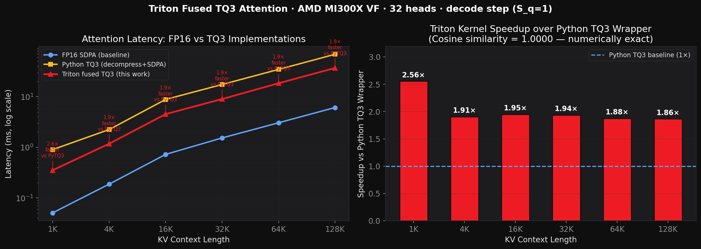
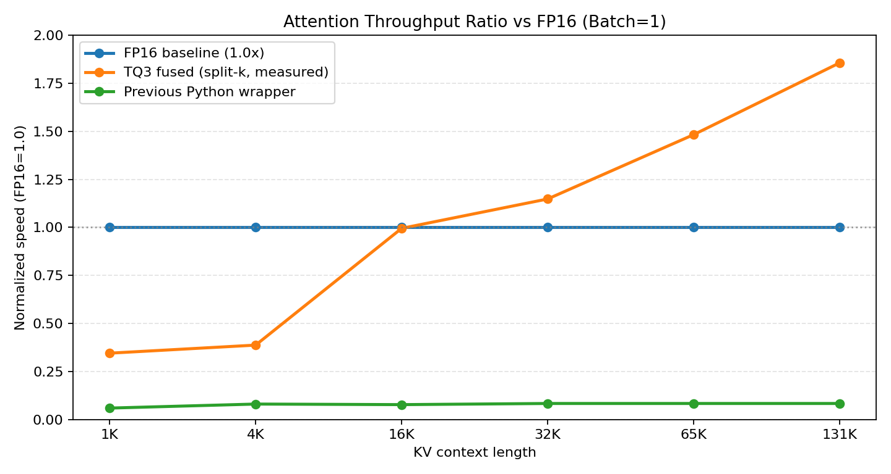

# Fused Attention vs FP16 Baseline (MI300X)

This note isolates the fused attention result and answers one question directly:
**How close did fused TQ3 get to the FP16 baseline?**

## Graph

 
## Added Graph (Normalized to FP16 = 1.0x)

Legend:
- Line 1: **FP16 baseline** (fixed at 1.0x)
- Line 2: **TQ3 fused (bit-plane + Split-K)**
- Line 3: **Previous Python wrapper**

*Ratios are normalized as `FP16_latency / method_latency`, so higher is better and 1.0 is baseline.*

## Baseline Proximity (Batch=1, Decode Step)

Measured on MI300X (gfx942), Mistral-style attention dimensions:

| seq_k | FP16 (ms) | Python wrapper (ms) | TQ3 fused Split-K (ms) | Fused vs FP16 |
|---|---:|---:|---:|---:|
| 1,024 | 0.054 | 0.912 | 0.155 | 0.35x |
| 4,096 | 0.188 | 2.338 | 0.485 | 0.39x |
| 16,384 | 0.725 | 9.409 | 0.729 | 1.00x |
| 32,768 | 1.534 | 18.560 | 1.336 | 1.15x |
| 65,536 | 3.058 | 36.681 | 2.063 | 1.48x |
| 131,072 | 6.109 | 73.462 | 3.289 | 1.86x |

### Bottom Line (What the Graph Says)

- Optimized fused path (Split-K) is **below FP16 at short context** (0.35-0.39x at 1K-4K),
  **matches at ~16K** (1.00x), and is **faster beyond that** (up to 1.86x at 131K).
- Previous Python wrapper stays around **0.06-0.09x** FP16.
- The fused kernel is now roughly **10-22x faster than the old Python wrapper** across the measured range.

## What Exactly Is the Issue?

### 1) Kernel-level issue (main blocker at batch=1)

- TQ3 reads fewer bytes, but must dequantize on the fly (bit unpack + centroid mapping + norm scaling).
- FP16 path is already highly optimized in SDPA/Flash-style kernels and maps very efficiently to MFMA.
- At short contexts, launch/reduction overhead and dequant arithmetic still dominate.
- With Split-K sequence parallelism, the kernel exposes far more work to the GPU as `seq_k` grows,
  so the 4.9x KV-byte reduction starts winning and overtakes FP16 at long context.

### 2) Why this is not a pure "vLLM problem"

- The short-context gap and long-context crossover come from fused-kernel measurements directly (outside vLLM),
  so this is not only a serving-stack artifact.
- vLLM can expose additional overhead depending on path selection, but it is not the root cause of the batch=1 fused-kernel gap.

### 3) Current vLLM-specific limitations

- Fused path is currently **decode-only** and **MHA-only**.
- For **GQA** and unsupported cases, vLLM falls back to the decompress + FP16 attention path.
- Any fallback introduces extra tensor movement/reformatting and can reduce end-to-end gains versus the isolated fused-kernel benchmark.
- The backend still needs broader fused coverage (especially GQA) to consistently translate kernel wins into serving wins.

### 4) Practical takeaway

- At batch=1: expect TQ3 fused attention to remain below FP16 due to dequant compute cost.
- At higher batch and longer context: KV bandwidth pressure rises, and TQ3 compression becomes more advantageous.
- To close the remaining single-batch gap further, the likely path is deeper quantized-domain compute (e.g., more direct low-precision matmul flow) plus fuller vLLM fused-path coverage.
